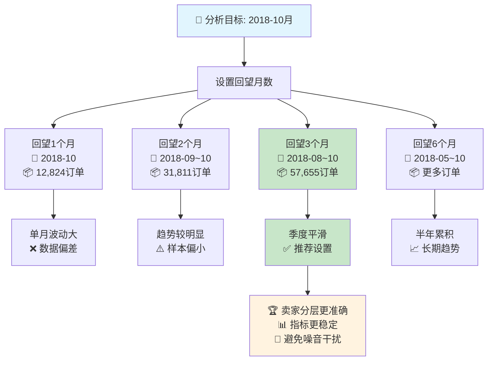

# 月度分析中的数据回望逻辑说明

## 📊 概述

在Olist电商平台的月度卖家分析中，**数据回望月数**（Lookback Months）是一个关键参数，用于控制在分析指定目标月份时向前追溯多少个月的历史数据来计算卖家的累积指标。

## 🎯 核心概念

### 基本定义
**数据回望月数**是指在分析某个目标月份时，向前追溯多少个月的历史数据来计算卖家的累积指标。

### 计算逻辑
假设分析 **2018-10月**，设置**回望3个月**：

```
目标月份: 2018-10
回望范围: 2018-08, 2018-09, 2018-10 (共3个月)
分析数据: 这3个月的累积订单、GMV、评分等
```

## 📈 时间窗口示意图



## 💡 业务价值

### 1. 避免单月波动

**问题：** 单月数据容易受到偶然因素影响
- 节假日效应
- 促销活动
- 数据收集不完整

**解决：** 多月累积平滑波动
```python
# 单月分析 (回望1个月)
2018-10月单独: 12,824个订单 → 可能因为月末数据不全造成偏差

# 多月累积 (回望3个月) 
2018-08~10月: 57,655个订单 → 数据更全面，趋势更稳定
```

### 2. 提供更稳定的分层标准

**示例：** 卖家ABC的表现分析

| 月份 | 订单数 | GMV | 评分 |
|------|--------|-----|------|
| 2018-08 | 15 | 3000 | 4.8 |
| 2018-09 | 8 | 1500 | 4.2 |
| 2018-10 | 2 | 400 | 3.5 (月末数据不全) |

**不同回望期的分层结果：**

| 回望设置 | 累积订单 | 累积GMV | 平均评分 | 分层结果 |
|---------|---------|---------|---------|---------|
| 1个月(10月) | 2 | 400 | 3.5 | Basic |
| 2个月(09-10) | 10 | 1900 | 3.85 | Basic |
| 3个月(08-10) | 25 | 4900 | 4.17 | **Bronze** |

**结论：** 3个月回望显示这是一个Bronze层卖家，但如果只看10月单月会误判为Basic层。

## ⚙️ 技术实现

### 核心代码逻辑

```python
def build_monthly_seller_profile(self, target_month: str, lookback_months: int = 3):
    # 计算时间窗口
    target_period = pd.Period(target_month)  # 2018-10
    start_period = target_period - lookback_months  # 2018-10 - 3 = 2018-07
    
    # 筛选数据范围
    orders_filtered = orders[
        (orders['year_month'] >= start_period) &  # >= 2018-07
        (orders['year_month'] <= target_period)   # <= 2018-10
    ].copy()
```

### 实际数据证明

从系统日志可以看到不同月份的订单量：

```
2018-08月: 25,844个订单
2018-09月: 18,987个订单  
2018-10月: 12,824个订单
总计(3月累积): 57,655个订单
```

## 📋 参数建议

| 回望月数 | 适用场景 | 优点 | 缺点 | 推荐度 |
|---------|---------|------|------|--------|
| 1个月 | 实时监控 | 及时反应 | 波动大，易误判 | ⭐⭐ |
| 3个月 | **常规分析** | 平衡稳定性和时效性 | 无明显缺点 | ⭐⭐⭐⭐⭐ |
| 6个月 | 长期趋势 | 数据稳定 | 反应滞后 | ⭐⭐⭐ |
| 12个月 | 年度评估 | 全面评价 | 失去月度特征 | ⭐⭐ |

## 🎯 最佳实践

### 推荐设置：3个月回望

**原因：**
1. **季度平滑：** 覆盖一个完整的季度，减少短期波动
2. **时效平衡：** 既保持时效性，又确保数据稳定性  
3. **业务契合：** 符合电商平台季度评估周期
4. **统计有效：** 有足够样本量支撑分析结论

### 使用场景建议

- **月度运营分析：** 使用3个月回望
- **实时监控预警：** 使用1个月回望
- **季度战略评估：** 使用6个月回望
- **年度绩效考核：** 使用12个月回望

## 📝 注意事项

1. **数据边界：** 回望期不能超出数据集的时间范围
2. **计算成本：** 回望期越长，计算时间越长
3. **业务理解：** 需要向业务团队解释回望逻辑，避免误解
4. **一致性：** 同一分析周期内保持回望期设置一致

---

*该文档详细说明了Olist电商平台月度卖家分析中数据回望逻辑的设计原理和业务价值，为系统使用者提供完整的理论支撑。* 