# Monthly Analysis Data Lookback Logic Documentation

## 📊 Overview

In the Olist e-commerce platform's monthly seller analysis, **Data Lookback Months** is a critical parameter that controls how many months of historical data to retrospectively include when analyzing a specified target month to calculate cumulative seller metrics.

## 🎯 Core Concepts

### Basic Definition
**Data Lookback Months** refers to how many months of historical data to retrospectively include when analyzing a specific target month to calculate cumulative seller metrics.

### Calculation Logic
For example, analyzing **October 2018** with **3-month lookback**:

```
Target Month: 2018-10
Lookback Range: 2018-08, 2018-09, 2018-10 (total 3 months)
Analysis Data: Cumulative orders, GMV, ratings from these 3 months
```

## 📈 Time Window Diagram

```mermaid
graph TD
    A["🎯 Analysis Target: Oct 2018"] --> B["Set Lookback Months"]
    
    B --> C1["1-Month Lookback<br/>📅 2018-10<br/>📦 12,824 orders"]
    B --> C2["2-Month Lookback<br/>📅 2018-09~10<br/>📦 31,811 orders"]
    B --> C3["3-Month Lookback<br/>📅 2018-08~10<br/>📦 57,655 orders"]
    B --> C4["6-Month Lookback<br/>📅 2018-05~10<br/>📦 More orders"]
    
    C1 --> D1["High monthly volatility<br/>❌ Data bias"]
    C2 --> D2["Trend more apparent<br/>⚠️ Small sample"]
    C3 --> D3["Quarterly smoothing<br/>✅ Recommended"]
    C4 --> D4["Semi-annual accumulation<br/>📈 Long-term trend"]
    
    D3 --> E["🏆 More accurate seller tiering<br/>📊 More stable metrics<br/>🔄 Noise reduction"]
    
    style A fill:#e1f5fe
    style C3 fill:#c8e6c9
    style D3 fill:#c8e6c9
    style E fill:#fff3e0
```



## 🔍 Why Do We Need Lookback?

### 1. **Avoid Single-Month Volatility**
```python
# Single-month analysis (1-month lookback)
Oct 2018 alone: 12,824 orders → May cause bias due to incomplete month-end data

# Multi-month accumulation (3-month lookback) 
Aug-Oct 2018: 57,655 orders → More comprehensive data, more stable trends
```

### 2. **Provide More Stable Tiering Standards**
```python
# Example: Seller A's performance under different lookback periods:
Single month (Oct): GMV=1000, Orders=5  → May be classified as Basic tier
3-month cumulative: GMV=5000, Orders=20 → Classified as Bronze tier (more accurate)
```

## 💡 Technical Implementation

### Core Code Logic
```python
# Calculate time window
target_period = pd.Period(target_month)  # 2018-10
start_period = target_period - lookback_months  # 2018-10 - 3 = 2018-07

# Filter data range
orders_filtered = orders[
    (orders['year_month'] >= start_period) &  # >= 2018-07
    (orders['year_month'] <= target_period)   # <= 2018-10
].copy()
```

### Actual Data Evidence
From system logs, we can see clear differences in order counts across months:
- **2018-08**: 25,844 orders
- **2018-09**: 18,987 orders  
- **2018-10**: 12,824 orders
- **Total (3-month)**: 57,655 orders for analysis

## 🏢 Business Scenario Example

### Hypothetical Seller ABC Performance:

```
Month      Orders    GMV      Rating
2018-08:     15      3000     4.8
2018-09:      8      1500     4.2  
2018-10:      2       400     3.5  (Incomplete month-end data)
```

**Tiering Results with Different Lookback Settings:**

| Lookback Setting | Cumulative Orders | Cumulative GMV | Avg Rating | Tier Result |
|-----------------|-------------------|----------------|------------|-------------|
| 1 month (Oct) | 2 | 400 | 3.5 | Basic |
| 2 months (Sep-Oct) | 10 | 1900 | 3.85 | Basic |
| 3 months (Aug-Oct) | 25 | 4900 | 4.17 | **Bronze** |

**Conclusion:** 3-month lookback reveals this is a Bronze-tier seller, but analyzing October alone would misclassify them as Basic tier.

## ⚙️ Parameter Recommendations

| Lookback Months | Use Case | Advantages | Disadvantages |
|----------------|----------|------------|---------------|
| 1 month | Real-time monitoring | Timely response | High volatility, prone to misjudgment |
| 3 months | **Regular analysis** | Balance of stability and timeliness | **Recommended** |
| 6 months | Long-term trends | Stable data | Delayed response |
| 12 months | Annual assessment | Comprehensive evaluation | Loses monthly characteristics |

## 🎯 Key Benefits

### 1. **Data Stability**
- Smooths out single-month fluctuations
- Provides more reliable seller performance indicators
- Reduces impact of seasonal or temporary factors

### 2. **Accurate Tiering**
- Prevents misclassification due to incomplete data
- Ensures fair evaluation across all sellers
- Maintains consistency in tier assignments

### 3. **Business Intelligence**
- Enables more confident decision-making
- Supports strategic seller relationship management
- Provides robust foundation for performance analysis

## 📋 Best Practices

### Recommended Settings by Use Case:

**🔍 Real-time Monitoring**: 1-month lookback
- Use when immediate response is critical
- Accept higher volatility for timely insights

**📊 Standard Analysis**: 3-month lookback ⭐
- **Default recommendation** for most scenarios
- Optimal balance of stability and responsiveness
- Captures quarterly trends effectively

**📈 Trend Analysis**: 6-month lookback
- Use for identifying long-term patterns
- Suitable for strategic planning
- Minimizes short-term noise

**📋 Annual Reviews**: 12-month lookback
- Comprehensive yearly assessments
- Policy and strategy development
- Long-term seller relationship evaluation

## 🔧 Implementation Notes

- **Minimum Lookback**: 1 month (target month only)
- **Maximum Lookback**: 12 months (based on available data)
- **Default Setting**: 3 months (recommended for most analyses)
- **Data Availability**: 25 months total (2016-09 to 2018-10)

---

*This documentation ensures users understand the technical implementation and business value of the data lookback functionality in the Olist monthly seller analysis system.* 